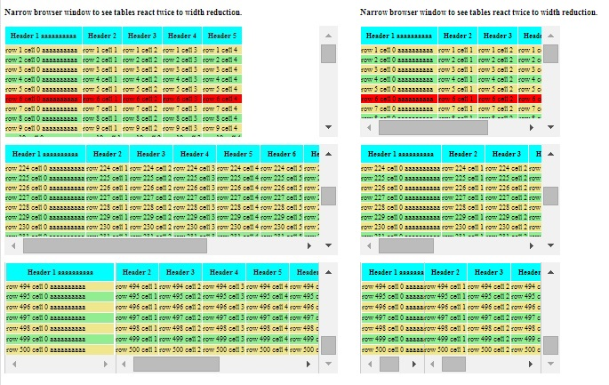

# [occlusionTable](https://github.com/eddyystop/mithril-components/tree/master/components/occlusionTable)

occlusionTable renders tables which may scroll vertically and horizontally.
Optional header rows are always displayed, as are optional pinned columns.
Both scroll bars always appear when needed, unlike traditional designs. 

The table height and width are preferably defined in the CSS, though they may be set programmatically.
occlusionTable may be used in responsive designs as the table width reacts to CSS media query changes.

occlusionControl works well with tables having a very large number of rows, 
as its renders only the rows which are then visible. (Its also fine for small numbers of rows!)

## Sample usage
### Result


### Code
```
<link href="../components/occlusionTable/occlusionTable.css" rel="stylesheet" type="text/css">

/* occlusionTable ========================================================= */
div#table0,
div#table1,
div#table2 {
    height: 250px !important;
    width: 750px !important;
}
@media all and (max-width: 800px) {
    div#table0,
    div#table1,
    div#table2 {
    height: 250px !important;
    width: 650px !important;
    }
}
@media all and (max-width: 700px) {
    div#table0,
    div#table1,
    div#table2 {
    height: 250px !important;
    width: 450px !important;
    }
}

div.mc-clipped-table-pinned div.scrollable {
    margin-left:35%;
}
div.mc-clipped-table-pinned div.pinned {
    width: 35%;
}

<script src="js/vendor/mithril.js"></script>
<script src="js/vendor/jquery.js"></script>
<script src="../components/utils/mcUtils.js"></script>
<script src="../components/occlusionTable/occlusionTable.js"></script>

app = {
    // model
    table0: m.prop(
        (function () {
          var t = [ ['Header 1 aaaaaaaaaa', 'Header 2', 'Header 3', 'Header 4', 'Header 5'] ];
          for (var i = 1; i < 501; i += 1) {
            var r = [];
            for (var j = 0; j < 6; j += 1) {
              r.push('row ' + i + ' cell ' + j + (j === 0 ? ' aaaaaaaaaa' : ''));
            }
            t.push(r);
          }
          return t;
        }())
    ),
    table1: m.prop(
        (function () {
          var t = [ ['Header 1 aaaaaaaaaa', 'Header 2', 'Header 3', 'Header 4', 'Header 5', 'Header 6', 'Header 7', 'Header 8', 'Header 9', 'Header 10'] ];
          for (var i = 1; i < 501; i += 1) {
            var r = [];
            for (var j = 0; j < 11; j += 1) {
              r.push('row ' + i + ' cell ' + j + (j === 0 ? ' aaaaaaaaaa' : ''));
            }
            t.push(r);
          }
          return t;
        }())
    ),
    
    // app
    controller: function () {
      this.ctrlTable0 = new mc.occlusionTable.controller(app.table0, m.prop(1));
      this.ctrlTable1 = new mc.occlusionTable.controller(app.table1, m.prop(1));
      this.ctrlTable2 = new mc.occlusionTable.controller(app.table1, m.prop(1), m.prop(1));
    },
    view: function (ctrl) {
      return [
        m('h3', 'Narrow browser window to see tables react twice to width reduction.'),
        m('p'),
        mc.occlusionTable.view(ctrl.ctrlTable0, null, null,
            {_wrapper: '#table0', _parent: '.parentSelector', _heading: '.headingSelector',
              _tr: '.trSelector', _odd: '.oddSelector', _even: '.evenSelector',
              '4': '.row4Selector'
            },
            {_wrapper: {wrapperAttr: ''},  _parent: {parentAttr: ''},  _heading: {style:{backgroundColor:'Aqua', height: '40px'}},
              _tr: {trAttr: ''},  _odd: {style:{backgroundColor:'LightGreen'}},  _even: {style:{backgroundColor:'Khaki'}},
              '4': {style:{backgroundColor:'Red'}}
            }
        ),
        m('p'),
        mc.occlusionTable.view(ctrl.ctrlTable1, null, null, {_wrapper: '#table1'}),
        m('p'),
        mc.occlusionTable.view(ctrl.ctrlTable2, null, null, {_wrapper: '#table2'}})
      ];
    }
};

m.module(document.body, app);
```

## Rest coming in a few hours