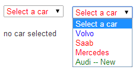

# [select](https://github.com/eddyystop/mithril-components/tree/master/components/select)

A simple select.

## Sample usage
### Results (with Bootstrap 3.2)


### Run it
Point browser at /mithril-components/public/select.html .

### Code
```
<link href="vendor/bootstrap/css/bootstrap.css" rel="stylesheet" type="text/css">

<script src="js/vendor/mithril.js"></script>
<script src="../components/utils/mcUtils.js"></script>
<script src="../components/select/select.js"></script>

var app = {
car: m.prop(''),

controller: function () {
  this.select = new mc.Select.controller(app.car);
},

view: function (ctrl) {
  var items = {
    'volvo' : 'Volvo',
    'saab' : 'Saab',
    'mercedes' : 'Mercedes',
    'audi' : [m('span','Audi'), m('span', ' -- New')]
  };
  return m('.container', [
      m('p'),
      mc.Select.view(ctrl.select, {
        items: items,
        caption: 'Select a car',
        selectors: {
          parent: '.list-group#selectId',
          item: '.list-group-item'
        },
        attrs: {
          parent: { style: {color: 'red'} },
          volvo: { style: {color: 'blue'} },
          audi: { style: {color: 'green'} }
        }
      }),
      m('div', {}, app.car() || 'no car selected')
    ]
  );
}
};

m.module(document.body, app);
```

## Controller
```
controller: function () {
  this.value = m.prop('');
  this.component = new mc.select.controller(value);
}
```

* `value {fcn | str | number}` 
The value selected. Must be an m.prop() to return the value selected.

## View
```
view: function (ctrl) {
  return mc.select.view(ctrl, options);
}
```

* `ctrl {obj}` is the controller.
* `options {obj}` contains the following properties:
    * `items {array of {str | numb | fcn | m() | array of m()} }` the items.
    A fcn is called. The m() frankly won't do much inside an < option>.
    * `caption {str | numb | fcn | m() | array of m()}` the caption.
    * `selectors {obj}` are the Mithril selectors attached to various elements in the table.
    * `attrs {obj}` are the Mithril attrs attached to various elements in the table.

`selectors` and `attrs` specify the Mithril selectors and attrs to be attached to 
different parts of the table, e.g. {parent: '.list-group#selectId', item: '.list-group-item'}

The locations are:
* `_parent` The < select> for the select.
* `item` The < option> for an item. 