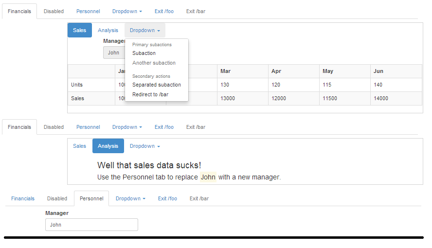

# [tabs](https://github.com/eddyystop/mithril-components/tree/master/components/tabs)

Display tabs.
 
A render function is supported for each tab, 
and it renders the tab's contents when the tab is active.
Each tab has an optional onclick handler. 
This may either redirect to another 'page' or be a customized function.

## Sample usage
#### Results (shown at 2 CSS media query breakpoints)


#### Run it
Point browser at /mithril-components/public/tabs.html .

#### Code
```
<link href="vendor/bootstrap/css/bootstrap.css" rel="stylesheet" type="text/css">
<link href="../components/tableResponsive/occlusionTable.css" rel="stylesheet" type="text/css">

<script src="js/vendor/mithril.js"></script>
<script src="../components/utils/mcUtils.js"></script>
<script src="../components/table/table.js"></script>
<script src="../components/tabs/tabs.js"></script>

var model = {
  mgrName: m.prop('John'),
  activeTabMain: m.prop('finance'),
  activeTabSub: m.prop('period')
};

// app =========================================================================
var app = {
  controller: function () {	},
  view: function (ctrl) {
    var self = this,
      tabOptions = {
        'finance': {
          label: 'Financials',
          render: function () { return self.renderFinanceContents(ctrl); },
          onclick: function () { console.log('tab finance was clicked'); }
        },
        'staff': {
          label: 'Personnel',
          render: function () {
            return [
              m('p'),
              m('form.col-md-offset-1.col-md-3',
                m('.form-group', [
                    m('label', 'Manager'),
                    m('input.form-control',
                      {onchange: m.withAttr('value', model.mgrName), value: model.mgrName()}
          )]))];}
        },
        'exit': {
          label: 'Exit',
          onclickRedirectTo:  '/foo'
        }
      };

    return m('.container', [
      m('p'),
      mc.Tabs.view(ctrl.tabs, model.activeTabMain, tabOptions)
    ]);
  },

  renderFinanceContents: function () {
    var tabOptions = {
      'period': {
        label: 'Sales',
        render: function () {
          var salesCtrl = new sales.controller();
          return sales.view(salesCtrl);
        }
      },
      'comment': {
        label: 'commentary',
        render: function () {
          return m('.row .col-md-offset-1', [
            m('h3', 'Well that sales data sucks!'),
            m('h4', [
              m('span', 'Use the Personnel tab to replace '),
              m('span.mark', model.mgrName()),
              m('span', ' with a new manager.')
        ])]);}
      }
    };

    return [
      m('.row', [
          m('p'),
          m('.col-md-offset-2', {style: {border: '1px solid Lightgrey'}}, [
              mc.Tabs.view(null, model.activeTabSub, tabOptions)
    ])])];
  }
};

// sales =======================================================================
var sales = {
  period: [
    ['',      'Jan', 'Feb', 'Mar', 'Apr', 'May', 'Jun'],
    ['Units', 100,   125,   130,   120,   115,   140],
    ['Sales', 10000, 12500, 13000, 12000, 11500, 14000]
  ],

  controller: function () {
    this.tableCtrl = new mc.Table.controller(m.prop(sales.period));
  },

  view: function (ctrl) {
    return [
      m('form.col-md-offset-1.col-md-3',
        m('.form-group', [
            m('label', 'Manager'),
            m('input.form-control', {disabled: true, value: model.mgrName()})
      ])),
      mc.Table.view(ctrl.tableCtrl, {selectors: {parent: '.table .table-bordered .table-striped'}})
    ];
  }
};

// foo =========================================================================
var foo = {
  controller: function () { },
  view: function () {
    return m('h1.col-md-offset-1.bg-warning', 'We have redirected to /foo');
  }
};

// routing =====================================================================
m.route(document.body, '/', {
  '/': app,
  '/foo': foo
});
```

## Controller

You need not instantiate a controller, though you can.

The tabs component is used within rendering functions, 
and it turns out its awkward to idiomatically instantiate a controller.
One state element is passed to the view, so this certainly is not the 'right' Mithril way to do things.
However we're letting practically win out.


## View  --- the rest is not yet done correctly
```
view: function (ctrl) {
  return mc.tableResponsive.view(ctrl, options);
}
```

* `ctrl {obj}` is the controller.
* `options {obj}` contains the following optional properties:
    * `isPlain {boolean | fcn | null defaults true}` is a normal table is to be rendered.
    A table with pinned columns will be rendered is false.
    A fcn is called and a {bool} is expected as a result.
    * `startRow {numb | default 0 }` the starting row to display (base 0).
    * `rows {numb | defaults to last row }` number of rows to display.
    * `pinnedCols {numb | default 1 }` the number of leading columns to pin (base 1).
    * `selectors {obj}` are the Mithril selectors attached to various elements in the table.
    * `attrs {obj}` are the Mithril attrs attached to various elements in the table.

`selectors` and `attrs` specify the Mithril selectors and attrs to be attached to 
different locations in the structure, e.g. `parent: '.table .table-bordered .table-striped'`

The locations are:
* `parent` The < table>.
* `tr` Every < tr>.
* `even` Even row < tr>.
* `odd` Odd row < tr>.
* `{number}` The < tr> of that row number (base 0).