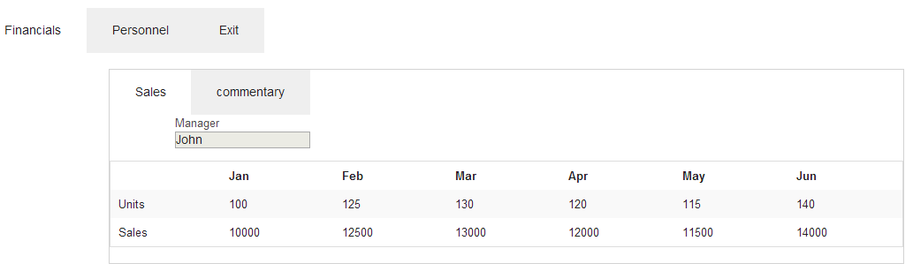

# [tabs](https://github.com/eddyystop/mithril-components/tree/master/components/tabs)

Display tabs and pills, including ones with dropdowns. 
The builtin *flavors* include:
* Bootstrap tabs.
* Bootstrap horizontal and vertical pills.
* Foundation horizontal and vertical tabs.

These *flavors* may be extended with custom ones. 
Alternatively you can specify the custom styling and attributes for some or all tags.
 
An selected item may automatically redirect to another 'page'.

## Sample usage
#### Results with Bootstrap


#### Results with Foundation


#### Run it
Bootstrap: Point browser at /mithril-components/public/tabs.html .

Foundation: Point browser at /mithril-components/public/tabs-zf.html .

#### Code
```
<link href="vendor/bootstrap/css/bootstrap.css" rel="stylesheet" type="text/css">
<link href="../components/tableResponsive/occlusionTable.css" rel="stylesheet" type="text/css">

<script src="js/vendor/mithril.js"></script>
<script src="../components/utils/mcUtils.js"></script>
<script src="../components/table/table.js"></script>
<script src="../components/tabs/tabs.js"></script>

  var model = {
    mgrName: m.prop('John'),
    activeTabMain: m.prop('finance'),
    activeTabSub: m.prop('period')
  };

  // app =========================================================================
  var app = {
    controller: function () {
      this.tabsCtrl = new mc.Tabs.controller(model.activeTabMain);
      this.tabsCtrl2 = new mc.Tabs.controller(model.activeTabSub);
    },
    view: function (ctrl) {
      var self = this,
        tabOptions = {
          flavor: 'bs/nav-tabs',
          tabs: [
            { name: 'finance', label: 'Financials' },
            { name: 'foo', label: 'Disabled', disabled: true },
            { name: 'staff', label: 'Personnel' },
            { name: 'dropdown', label: 'Dropdown', dropdown: [
              {label: 'Primary actions', type: 'header' },
              {name: 'action1', label: 'Action'},
              {name: 'action2', label: 'Another action', disabled: true },
              {type: 'divider' },
              {label: 'Secondary actions', type: 'header' },
              {name: 'action9', label: 'Separated action' },
              {label: 'Exit bar', redirectTo: '/bar'}
            ]},
            { name: 'exit', label: 'Exit /foo', redirectTo:  '/foo' },
            { name: 'exit2', label: 'Exit /bar', redirectTo:  '/bar', disabled: true }
          ]
        };

      return m('.container', [
        m('p'),
        mc.Tabs.view(ctrl.tabsCtrl, tabOptions),
        renderTabContents(ctrl)
      ]);

      function renderTabContents (ctrl) {
        switch (model.activeTabMain()) {
          case 'finance':
            return self.renderFinanceContents(ctrl);
          case 'staff':
            return [
              m('p'),
              m('form.col-md-offset-1.col-md-3',
                m('.form-group', [
                    m('label', 'Manager'),
                    m('input.form-control',
                      {onchange: m.withAttr('value', model.mgrName), value: model.mgrName()}
                    )
                  ]
                )
              )
            ];
          default:
            return m('h1', model.activeTabMain());
        }
      }
    },

    renderFinanceContents: function (ctrl) {
      var tabOptions = {
        activeTabName: model.activeTabSub,
        flavor: 'bs/nav-pills',
        tabs: [
          { name: 'period', label: 'Sales' },
          { name: 'comment', label: 'Analysis' },
          { name: 'dropdownFinance', label: 'Dropdown', dropdown: [
            { type: 'header', label: 'Primary subactions' },
            { name: 'action1', label: 'Subaction' },
            { name: 'action2', label: 'Another subaction', disabled: true },
            { type: 'divider' },
            { type: 'header', label: 'Secondary actions' },
            { name: 'action9', label: 'Separated subaction' },
            { name: 'exit2', label: 'Redirect to /bar', redirectTo:  '/bar' }
          ]}
        ]
      };

      return [
        m('.row', [
          m('p'),
          m('.col-md-offset-2', {style: {border: '1px solid Lightgrey'}}, [
              mc.Tabs.view(ctrl.tabsCtrl2, tabOptions),
              renderFinanceTabContents()
            ]
          )
        ])
      ];

      function renderFinanceTabContents () {
        switch (model.activeTabSub()) {
          case 'period':
            var salesCtrl = new sales.controller();
            return sales.view(salesCtrl);
          case 'comment':
            return m('.row.col-md-offset-1', [
              m('h3', 'Well that sales data sucks!'),
              m('h4', [
                  m('span', 'Use the Personnel tab to replace '),
                  m('span.mark', model.mgrName()),
                  m('span', ' with a new manager.')
                ]
              )
            ]);
          default:
            return m('h1', model.activeTabSub());
        }
      }
    }
  };

  // sales =======================================================================
  var sales = {
    period: [
      ['',      'Jan', 'Feb', 'Mar', 'Apr', 'May', 'Jun'],
      ['Units', 100,   125,   130,   120,   115,   140],
      ['Sales', 10000, 12500, 13000, 12000, 11500, 14000]
    ],

    controller: function () {
      this.tableCtrl = new mc.Table.controller(m.prop(sales.period));
    },

    view: function (ctrl) {
      return [
        m('form.col-md-offset-1.col-md-3',
          m('.form-group', [
              m('label', 'Manager'),
              m('input.form-control', {disabled: true, value: model.mgrName()})
            ]
          )
        ),
        mc.Table.view(ctrl.tableCtrl, {selectors: {parent: '.table.table-bordered.table-striped'}})
      ];
    }
  };

  // foo =========================================================================
  var foo = {
    controller: function () { },
    view: function () {
      return m('h1.col-md-offset-1.bg-warning', 'We have redirected to another route');
    }
  };

  // routing =====================================================================
  m.route(document.body, '/', {
    '/': app,
    '/:tab': foo
  });
```

## Controller

```
controller: function () {
  this.component = new mc.Tabs.controller(activeTabName);
}
```

* `activeTabName {fcn | str | defaults to name of first tab}` 
The name of the tab currently *open*. 

You can set the activeTagName to the current route name as follows:
```
options.activeTagName = m.route.param('tab');
...
m.route(document.body, '/', {
  '/': app,
  '/:tab': app
});
```

## View
```
view: function (ctrl) {
  return mc.Tabs.view(ctrl, options);
}
```

* `ctrl {obj}` is the controller.
* `options {obj}` contains the following properties:
    * `flavor {str optional}` Create a particular version of the component. 
    Otherwise the `selectors` and `attrs` options alone will to style the component.
    The flavors are:
        * `'bs/nav-tabs'` Bootstrap tabs.
        * `'bs/nav-pills'` Bootstrap pills.
        * `'bs/nav-pills.nav-stacked'` Bootstrap vertical pills.
        * `'zf/tabs'` Foundation tabs
        * `'zf/tabs.vertical'` Foundation vertical tabs.
    * `tabs {array of {obj}}` Definition of the tabs. 
    Each array element defines a tab item, and looks like:
        * `{ name:, label:, type:, disabled:, dropdown:, redirectTo: }` 
        Definition of one tab.
            * `name {str optional}` The tab name.
            Ignored for `type` header and divider, required otherwise.
            * `label {fcn | str | default is name}` The text to appear as the label.
            * `type {str optional}` Allowed within dropdowns.
                * `"header"` Display as a heading, not as an item.
                * `"divider"` Display a horizontal divider.
            * `disabled {bool | defaults to false}` If the item is disabled.
            * `dropdown {obj like tabs, optional}`
            The presence of `dropdown` indicates the item is a dropdown,
            and its value itemizes the items in the dropdown.
            Dropdown items are defined in the same manner as tab items.
            * `redirectTo {str URL | fcn returning URL | optional}` 
            Redirect to this route if the tab is clicked.
    * `selectors {obj}` Mithril selectors..
    * `attrs {obj}` Mithril attributes.
    
`selectors` and `attrs` are standard Mithril selectors and attributes.
They are added to specific tags in the component, 
after any selectors or attrs provided by the optional `flavor`.
A `selectors` may look like `{ parent: '.nav', itemDisabled: '.disabled', itemActive: '.active' }`.
This adds selectors to `locations` parent, itemDisabled and itemActive.

Below is the first rendered tabs component in the example above. 
The `locations` where you can added `selectors` and `attrs` are shown.
```
<ul class="nav nav-tabs"> <--- .parent
  <li class="active"> <--- .itemActive
    <a>Financials</a> <--- .linkActive
  </li>
  <li class="disabled"> <--- .itemDisabled
    <a>Disabled</a> <--- .linkDisabled
  </li>
  <li> <--- .item
    <a>Personnel</a> <--- .link
  </li>
  <li class="open"> <--- .dd .ddOpen .ddDisabled
    <a class="dropdown-toggle"> <-- .ddLink
      <span>Dropdown  </span>
      <span class="caret"> </span> <--- dd.caret
    </a>
    <ul class="dropdown-menu"> <--- ddMenu
      <li class="dropdown-header">Primary actions</li> <--- .itemHeader
      <li>  <--- .item
        <a>Action</a> <-- .link
      </li>
      <li class="disabled"> <--- .itemDisabled
        <a>Another action</a> <--- .linkDisabled
      </li> 
      <li class="divider" style="margin: 6px 0px;"></li> <--- itemDivider
      <li class="dropdown-header">Secondary actions</li>
      <li><a>Separated action</a></li>
      <li><a href="/public/tabs2.html?/bar">Exit bar</a></li>
    </ul>
  </li>
  <li><a href="/public/tabs2.html?/foo">Exit /foo</a></li>
  <li class="disabled"><a>Exit /bar</a></li>
</ul>
```

`flavors` are now easy to explain. 
They are predefined sets of `selectors` and `attrs`. 
You will find them defined at the start of the JS file.
You can add a new `flavor` by attaching a new selector and/or attr, e.g.
```
mc.Tabs.flavorsSelectors['bs/nav-pills=bold'] = mc.utils.combineSelectors(
  {}, mc.Tabs.flavorsSelectors['bs/nav-pills'], {item: '.myBoldClass'});
mc.Tabs.flavorsAttrs['bs/nav-pills=bold'] = mc.utils.extend(
  {}, mc.Tabs.flavorsAttrs['bs/nav-pills']);
```